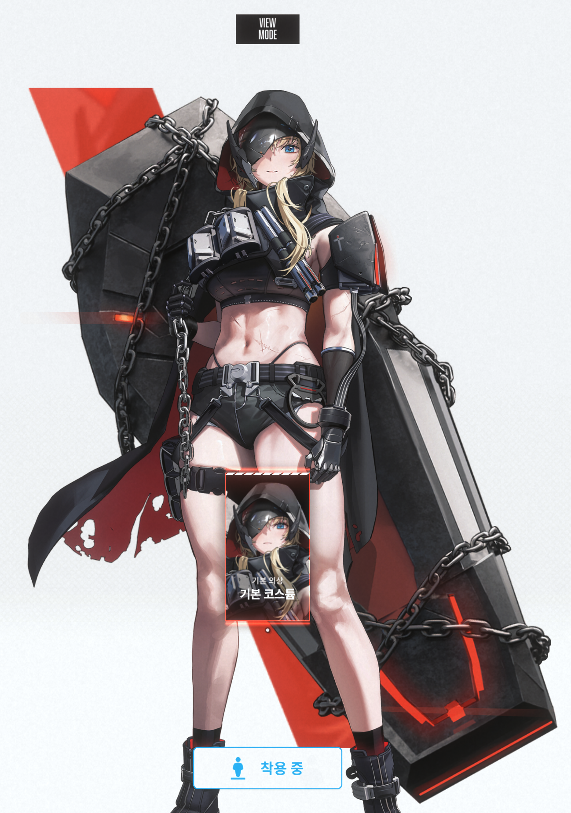
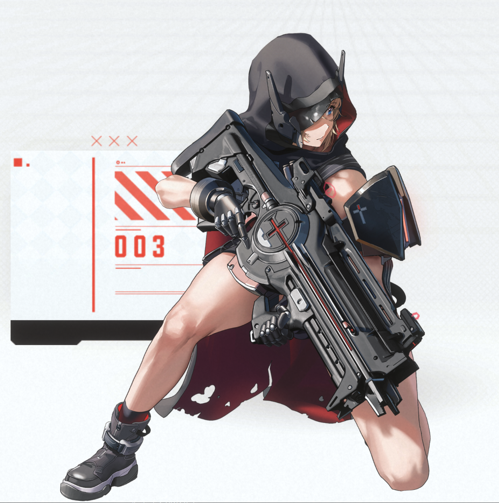
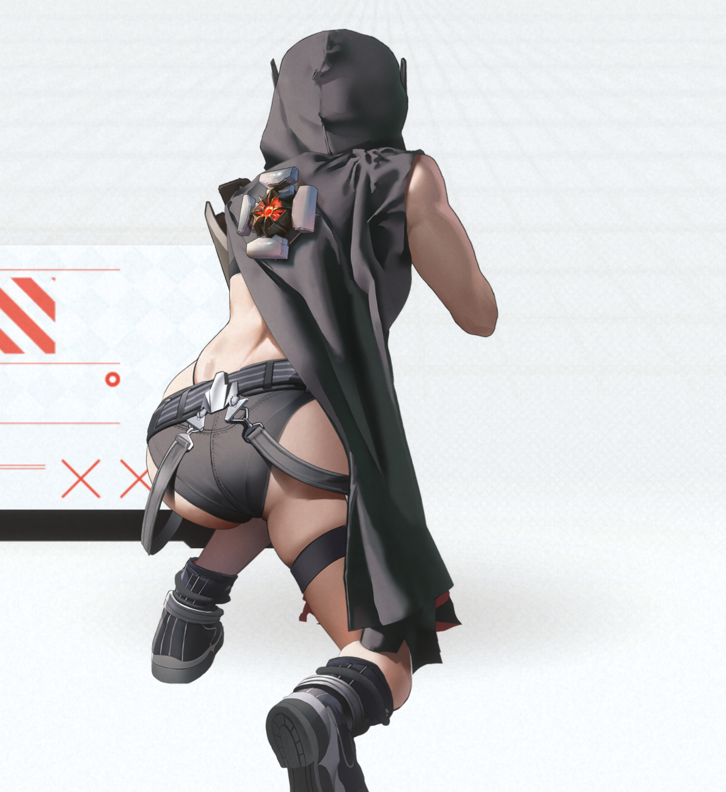
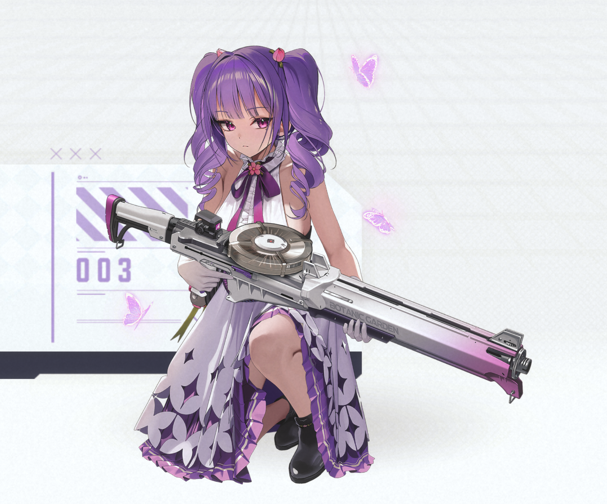
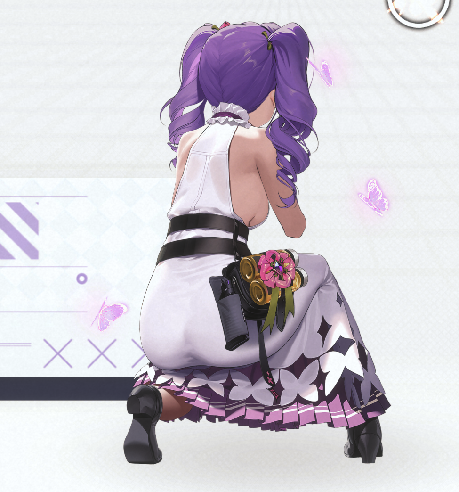

# Nikke DB

그레이브 (CV : 한미리)

[방열 제거 조건]에 대해 
◆ 재장전 도중 일반 공격 진행 시 방열 스킬이 제거 됩니다. 
◆ 재장전을 최대 장탄까지 완료하였을 때 방열 스킬이 제거 
  됩니다. 
◆ 버스트 스킬을 사용하였을 때 방열 스킬이 제거 됩니다. 
 
스킬1 ▶ 방열 
레벨 10 
패시브 
미래예지 상태 종료 시 자신에게 
[탄환 100% 제거] 
[방열: 재장전 비율 50%▼] [방열 제거 조건] 
■ 자신이 방열 상태일 때 한하여 자신에게 
[최종 최대 체력 비례 2% 회복] [1초 간격] [지속] 
■ 자신이 방열 상태일 때 한하여 아군 전체에게 
[버스트 게이지 충전 속도 38.96% ▲] [지속] 
[관통 대미지 48.4% ▲] [지속] 
 
스킬2 ▶ 과열 
레벨 10 
패시브 
일반 공격 15회 명중 시 자신에게 
[과열 I : 공격력 15.48% ▲] [최대 장탄 재장전 완료 
시삭제] 
미래예지 상태 적용 후 일반 공격 명중 시 자신에게 
[공격 명중 횟수 별 효과] [하위 효과 중복 적용] 
30회 : 미래예지와 과열 I 상태일 때 한하여 
[과열 II : 공격력 20.66% ▲] [지속] 
60회 : 미래예지와 과열 I 상태일 때 한하여 
[과열 III : 공격 대미지 30.8% ▲] [지속] 
 
버스트 스킬 ▶ 라이터즈 스포일러 
레벨 10 
20.0초 
액티브 
자신에게 
[미래예지]
[현재 체력 1% ▼] [1초 간격] [10초 유지] 
[장탄수 무한] [10초 유지] 
[관통 특화] [10초 유지] 
[관통 대미지 52.8% ▲] [10초 유지] 
[크리티컬 확률 85.19% ▲] [10초 유지] 
■ 아군 전체에게 
[공격 대미지 48.2% ▲] [10초 유지] 
[관통 대미지 39.98% ▲] [10초 유지] 
[최대 장탄수 3발 ▲] [10초 유지] 
 

플로라 (CV : 채림) 
스킬은 프로덕트 12 코드, 무기, 버스트, 스킬로 채워넣은 상태
<!--Nikke DB는 게임 "승리의 여신: 니케"와 관련된 다양한 정보를 제공합니다. 이 데이터베이스는 플레이어가 니케, 스킬, 스토리 대사, 아이템 정보 등을 모아 놓은 것입니다. -->